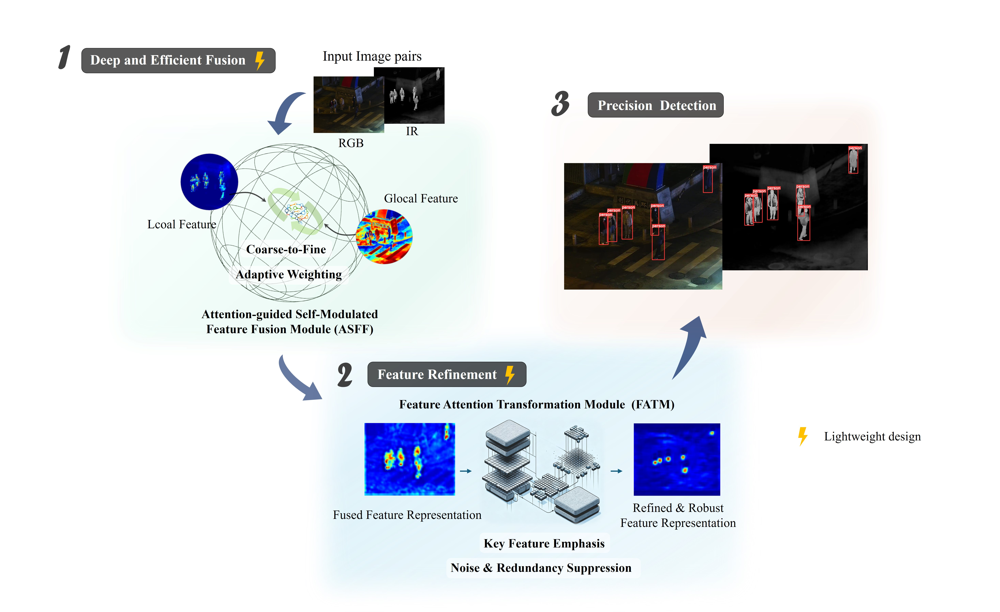
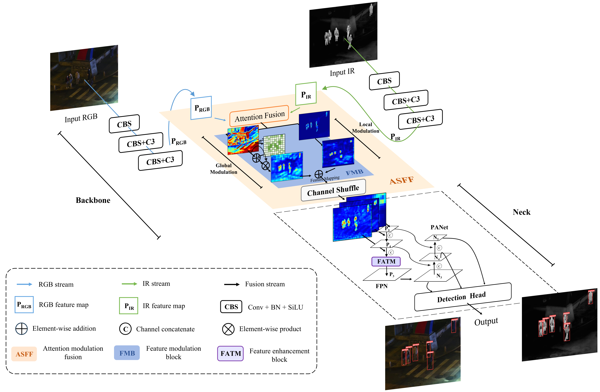

# LASFNet: Lightweight Attention-guided Self-modulation Feature Fusion Network

Official implementation of the paper **"LASFNet: a lightweight attention-guided self-modulation feature fusion network for multimodal object detection"** (IEEE Transactions on Cybernetics, 2026).

LASFNet is a lightweight multimodal object detection framework that fuses RGB and infrared (IR) features via an attention-guided self-modulation mechanism. It builds upon the YOLOv5 architecture and introduces a novel **attention-guided self-modulation feature fusion (ASFF)** module for effective cross-modal feature fusion.

## Graphical Abstract



## Network Architecture



---

## Supported Datasets

| Dataset | Config File | Classes |
|---------|-------------|---------|
| LLVIP | `data/LLVIP.yaml` | person |
| M3FD | `data/M3FD_new.yaml` | people, car, bus, lamp, motorcycle, truck |
| DroneVehicle | `data/DroneVehicle_new.yaml` | car, freight car, truck, bus, van |
| VTUAV-det | `data/VTUAV_det.yaml` | person |

---

## Download

### Datasets

We provide the four preprocessed datasets (LLVIP, M3FD, DroneVehicle, VTUAV-det) as compressed archives ready for training with LASFNet.

- **Baidu Netdisk**: [Download link](https://pan.baidu.com/s/1AJBpNWjsxQHAjr3Bo5BiYw?pwd=LASF) | Password: `LASF`
- The datasets are located in the `dataset/` folder of the shared drive.

#### Setup Instructions

1. Download the dataset archives from the Baidu Netdisk link above.
2. Extract each archive directly into the `dataset/` folder under the project root:

```
LASFNEet/
├── dataset/
│   ├── LLVIP/
│   │   ├── visible/
│   │   │   ├── train/images/
│   │   │   └── test/images/
│   │   └── infrared/
│   │       ├── train/images/
│   │       └── test/images/
│   ├── M3FD/
│   │   ├── train_new/
│   │   │   ├── rgb/images/
│   │   │   └── ir/images/
│   │   └── test_new/
│   │       ├── rgb/images/
│   │       └── ir/images/
│   ├── dronevehicle_new/
│   │   ├── data_rgb/
│   │   │   ├── train/images/
│   │   │   └── val/images/
│   │   └── data_ir/
│   │       ├── train/images/
│   │       └── val/images/
│   └── VTUAV_det/
│       ├── train/
│       │   ├── rgb/images/
│       │   └── ir/images/
│       └── test/
│           ├── rgb/images/
│           └── ir/images/
```

3. Verify the paths match the corresponding YAML configuration files in the `data/` directory:

| Dataset | YAML Config |
|---------|-------------|
| LLVIP | `data/LLVIP.yaml` |
| M3FD | `data/M3FD_new.yaml` |
| DroneVehicle | `data/DroneVehicle_new.yaml` |
| VTUAV-det | `data/VTUAV_det.yaml` |

### Pre-trained Weights

We also provide the optimal training weights for LASFNet on each dataset, obtained through the training configurations described below. The checkpoint files are available in the `runs/` folder of the same Baidu Netdisk link.

| Dataset | Backbone | Checkpoint |
|---------|----------|------------|
| LLVIP | LASFNet | `runs/LLVIP/weights/best.pt` |
| M3FD | LASFNet | `runs/M3FD/weights/best.pt` |
| DroneVehicle | LASFNet | `runs/DroneVehicle/weights/best.pt` |
| VTUAV-det | LASFNet | `runs/VTUAV/weights/best.pt` |

To use a pre-trained weight for inference or validation, simply pass the checkpoint path to `--weights`:

```bash
python val.py --data data/LLVIP.yaml --weights runs/LLVIP/weights/best.pt --device 0
```

---

## Installation

```bash
# Create conda environment
conda create -n lasfnet python=3.10
conda activate lasfnet

# Install PyTorch (CUDA 12.1)
pip install torch==2.1.1 torchvision==0.16.1 torchaudio==2.1.1

# Install remaining dependencies
pip install -r requirements.txt
```

---

## Usage

### 1. Training (`train.py`)

#### Single-GPU Training

```bash
python train.py \
    --data data/LLVIP.yaml \
    --cfg models/LASFNet.yaml \
    --weights '' \
    --epochs 300 \
    --batch-size 16 \
    --imgsz 640 \
    --device 0
```

Key arguments:
| Argument | Default | Description |
|----------|---------|-------------|
| `--data` | `data/LLVIP.yaml` | Dataset config file |
| `--cfg` | `models/LASFNet.yaml` | Model config file |
| `--weights` | `''` | Pretrained weights path (empty = train from scratch) |
| `--epochs` | `300` | Total training epochs |
| `--batch-size` | `2` | Batch size (total across all GPUs in DDP) |
| `--imgsz` | `640` | Image size |
| `--device` | `1,2` | CUDA device(s), e.g. `0` or `0,1,2,3` or `cpu` |
| `--optimizer` | `SGD` | Optimizer: `SGD`, `Adam`, or `AdamW` |
| `--sync-bn` | `False` | Use SyncBatchNorm (DDP mode only) |
| `--cos-lr` | `False` | Cosine LR scheduler |
| `--resume` | `False` | Resume from last checkpoint |
| `--workers` | `4` | Dataloader workers per GPU |
| `--patience` | `100` | EarlyStopping patience |
| `--project` | `runs/train` | Save directory |
| `--name` | `exp` | Experiment name |

#### Multi-GPU Distributed Training (DDP)

The project uses `torch.distributed.run` for multi-GPU training. The DDP mode is automatically enabled when launched via `torch.distributed.run`.

```bash
# 2 GPUs (recommended default)
python -m torch.distributed.run --nproc_per_node 2 train.py \
    --data data/LLVIP.yaml \
    --cfg models/LASFNet.yaml \
    --weights '' \
    --epochs 300 \
    --batch-size 16 \
    --imgsz 640 \
    --device 0,1

# 4 GPUs
python -m torch.distributed.run --nproc_per_node 4 train.py \
    --data data/LLVIP.yaml \
    --cfg models/LASFNet.yaml \
    --weights '' \
    --epochs 300 \
    --batch-size 32 \
    --imgsz 640 \
    --device 0,1,2,3
```

> **Note**: When using DDP, `--batch-size` specifies the total batch size across all GPUs. The per-GPU batch size is automatically computed as `batch_size // world_size`. The `--local_rank` argument is handled automatically — do not modify it manually.

#### Resume Training

```bash
# Resume from the most recent run
python train.py --resume

# Resume from a specific checkpoint
python train.py --weights runs/train/exp/weights/last.pt --resume
```

---

### 2. Validation (`val.py`)

Evaluate a trained model on a test dataset.

```bash
python val.py \
    --data data/LLVIP.yaml \
    --weights runs/train/exp/weights/best.pt \
    --batch-size 32 \
    --imgsz 640 \
    --device 0
```

Key arguments:
| Argument | Default | Description |
|----------|---------|-------------|
| `--data` | `data/LLVIP.yaml` | Dataset config file |
| `--weights` | `runs/seq-VTUAV/weights/best.pt` | Model weights path(s) |
| `--batch-size` | `32` | Batch size |
| `--imgsz` | `640` | Inference image size |
| `--conf-thres` | `0.001` | Confidence threshold |
| `--iou-thres` | `0.6` | NMS IoU threshold |
| `--device` | `1` | CUDA device |
| `--half` | `False` | FP16 half-precision inference |
| `--augment` | `False` | Augmented inference (TTA) |
| `--save-txt` | `False` | Save detection results to txt files |
| `--save-json` | `False` | Save results in COCO JSON format |
| `--project` | `runs/val` | Save directory |

---

### 3. FLOPs & Parameters Analysis (`vis-flops.py`)

Compute and visualize the FLOPs and parameter count of a trained LASFNet model.

```bash
python vis-flops.py
```

Before running, modify the model path in `vis-flops.py` to point to your trained checkpoint:

```python
model = YOLO(r'runs/LLVIP/weights/best.pt').model  # change to your .pt path
```

The script outputs a formatted table showing FLOPs and parameter counts for each layer, along with the total model complexity.

---

## Citation

If you use LASFNet in your research, please cite our paper:

```bibtex
@article{hao2026lasfnet,
  title={LASFNet: a lightweight attention-guided self-modulation feature fusion network for multimodal object detection},
  author={Hao, Lei and Xu, Lina and Liu, Chang and Dong, Yanni},
  journal={IEEE Transactions on Cybernetics},
  year={2026},
  publisher={IEEE}
}
```

---

## License

This project is built upon [YOLOv5](https://github.com/ultralytics/yolov5) (AGPL-3.0). The LASFNet modifications are also released under AGPL-3.0.
